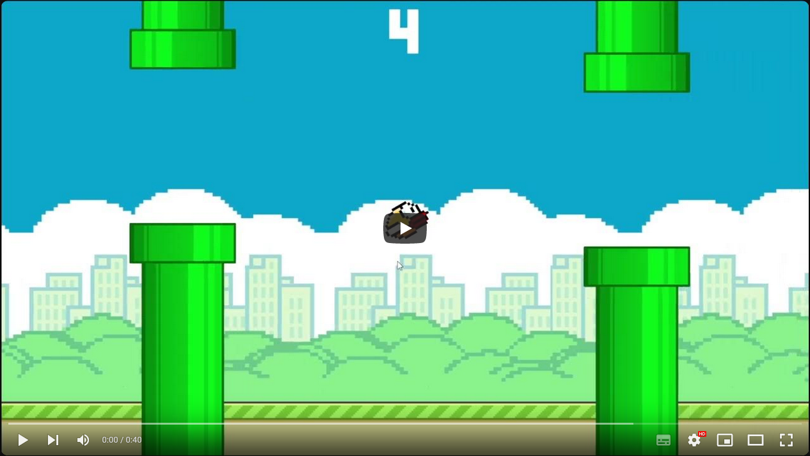

# Flappy Bird

This is my approach to recreate the famous Flappy Bird game.
It's a very basic project which implements only the key mechanics
that need to be there to actually play the game. You can call
it "core" mechanics. You just click left mouse button and fly
through the pipes. That's it.

Your last score and best score ever done are saved between
game sessions, so no worries!

### Youtube:

 
